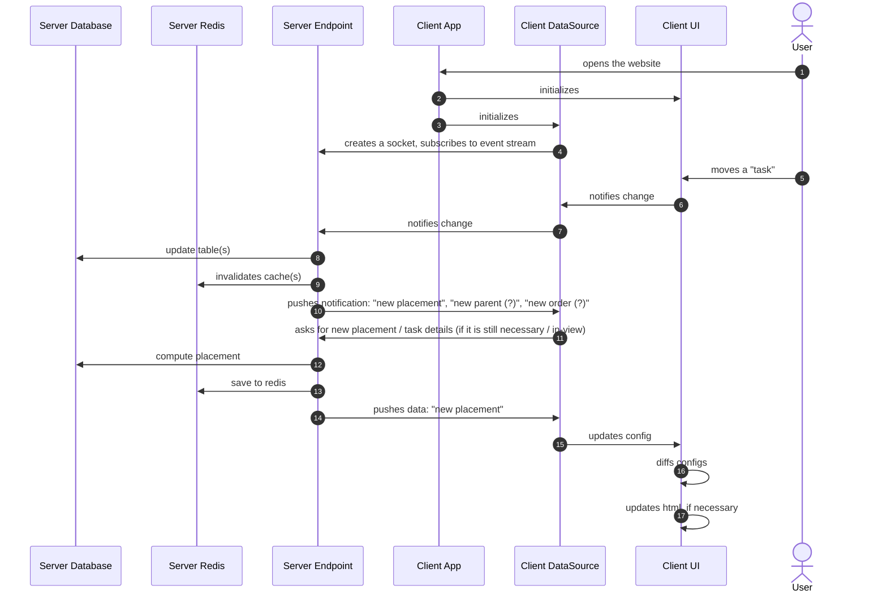

# Sequence

## Syntax

### Definition

```ebnf
(* FUNDEMANTALS *)
ALIAS    ::= (WORD | DIGIT | SPACE)+
TEXT     ::= (WORD | DIGIT | SPACE)+
LIFELINE ::= WORD

(* DECLARATIONS *)
BOX ::= ""

(* STATEMENTS *)
LIFELINE_DECL ::= ( "participant" | "actor" ) LIFELINE [ "as" ALIAS ]
MESSAGE       ::= LIFELINE "->>" LIFELINE [ ":" TEXT ]
ACTIVATE      ::= "activate" LIFELINE
DEACTIVATE    ::= "deactivate" LIFELINE
CREATE        ::= "create" LIFELINE_DECL
DESTROY       ::= "destroy" LIFELINE

(* THE DIAGRAM *)
DECLARATION ::= ( BOX )
STATEMENT   ::= ( LIFELINE_DECL | MESSAGE | CREATE | DESTROY |  )
DIAGRAM     ::= "sequenceDiagram" ["autoNumber"] { DECLARATION } { STATEMENT }
```

### Example



## Statements

### Lifelines

#### Declaring

Lifelines are declared as either **participant** or **actor** with or without aliasing. Aliases lets you refer to the lifeline using shorter names (such as initials) later in the diagram code without the head box text losing its descriptiveness. Declaring lifelines is not required. Mentioning messages trigger implicit lifeline declaration with defaults.

```mermaid
participant AppServer
participant ws as WebServer
actor Alice
actor b as Bob
```

#### Creating

`create`

#### Destroying

`destroy`

#### Grouping

Boxes can be used to group 2 or more lifelines and their belongings within a rounded box. Background color of the box can be customized with providing a HEX code before the title.

```mermaid
box #ff0000 Participants
  participant AppServer
  participant WebServer
end

box #0000ff Actors
  actor a as Alice
  actor b as Bob
end
```

#### Activating

`activate`

#### Deactivating

`deactivate`

### Messages

`message`

### Note

`note`

#### WideNote

`widenote`

### Controlling flow

#### Break

`break`

#### Loop

`loop`

#### Critical

`critical`

#### Option

`option`

#### Parallel

`parallel`

#### Alt

`alt`
